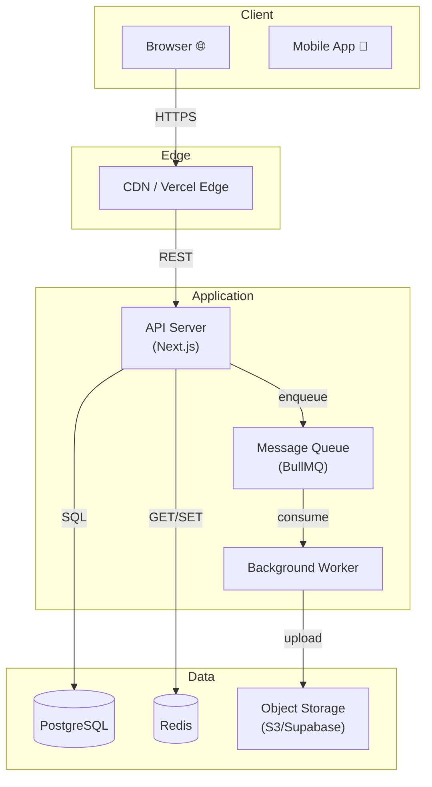
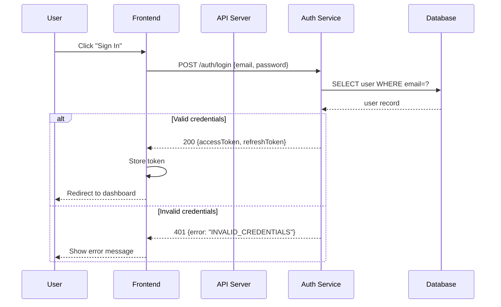
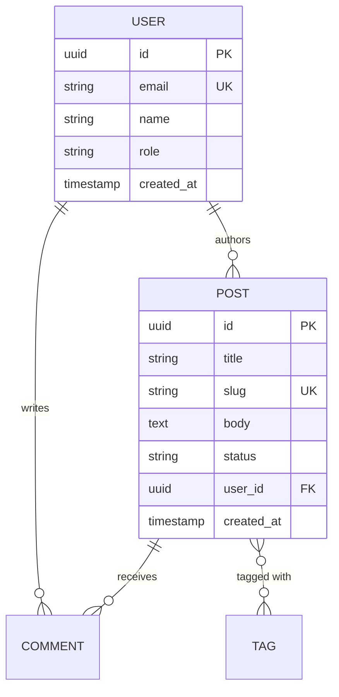

<!-- @keywords: diagram, architecture diagram, sequence diagram, flow diagram, system diagram, mermaid, component diagram -->
<!-- @domain: Architecture Diagram Prompts -->

# Architecture Diagram Prompts

## System Architecture Diagram (Mermaid)

```
Create a system architecture diagram in Mermaid syntax for:

**System:** [describe the system]

**Components to include:**
- Client: [browser / mobile / both]
- Load balancer / CDN
- Application servers: [list services]
- Databases: [list DBs with their type]
- External services: [list third-party APIs]
- Message queue / event bus: [if applicable]
- Cache layer: [Redis / CDN / in-memory]

**Show:**
- Data flow direction (→ arrows)
- Communication type (REST, WebSocket, event, DB query)
- Grouping by environment (client / edge / application / data layer)

**Format:**
graph TD or flowchart LR — whichever makes the topology clearest.

Label each arrow with: [protocol / operation type]
Use subgraph to group related components.
```

**Example output format:**


---

## Sequence Diagram

```
Create a sequence diagram for: [user action or system process]

**Participants:**
- [Actor/Service 1]
- [Actor/Service 2]
- [Actor/Service 3]
- [External: Auth0 / Stripe / etc.]

**Flow to diagram:**
1. [who] → [who]: [action/message]
2. [who] → [who]: [action/message]
3. [conditional] if [condition]: [branch A], else: [branch B]
4. ...

**Include:**
- Happy path
- Error/failure path (alt blocks)
- Async operations (if applicable)

**Format:** Mermaid sequenceDiagram syntax
```

**Example:**


---

## Data Flow Diagram

```
Create a data flow diagram showing how [data type] moves through the system.

**Data:** [user data / order / file / event / etc.]
**Starting point:** [where data enters — user form / webhook / upload / API]
**End point:** [where data is ultimately stored or consumed]

**Transformation steps:**
- Step 1: [what happens to the data]
- Step 2: [transformation, validation, enrichment]
- Step 3: [storage or forwarding]
- Step 4: [final destination]

**Show:**
- What the data looks like at each step (key fields)
- Who/what performs each transformation
- Where validation happens
- Where data is persisted

**Format:** flowchart LR (left-to-right) for linear flows
```

---

## Database Entity-Relationship Diagram

```
Create an ER diagram for this data model.

**Entities:**
[list: User, Post, Comment, Tag, etc.]

**Relationships:**
- User has many Posts (one-to-many)
- Post has many Tags (many-to-many via PostTag)
- Post has many Comments (one-to-many)
- Comment belongs to User and Post

**For each entity, key attributes:**
- User: id, email, name, role, created_at
- Post: id, title, slug, body, status, user_id, created_at
- Tag: id, name, slug
- Comment: id, body, user_id, post_id, created_at

**Format:** Mermaid erDiagram syntax
```

**Example:**


---

## Infrastructure / Deployment Diagram

```
Create a deployment/infrastructure diagram for:

**Environment:** [production / staging / development]
**Cloud provider:** [AWS / GCP / Azure / Vercel / self-hosted]

**Components to map:**

**Compute:**
- [service]: deployed on [EC2 / ECS / Lambda / Vercel / GKE]
- [service]: ...

**Networking:**
- Domain / DNS
- Load balancer type
- VPC / private network topology
- CDN coverage

**Data:**
- Database: [type, hosting, replication]
- Cache: [Redis / Memcached — self-hosted / ElastiCache]
- Object storage: [S3 / GCS / Supabase Storage]

**Security:**
- WAF placement
- Private vs public subnets
- Secrets management

**Format:** flowchart TB or Mermaid graph TD with subgraphs for network zones.
Include: which components are in private subnet vs public, 
and which external services are connected.
```
