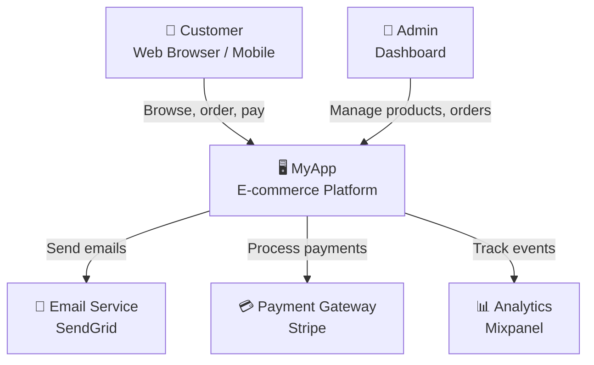
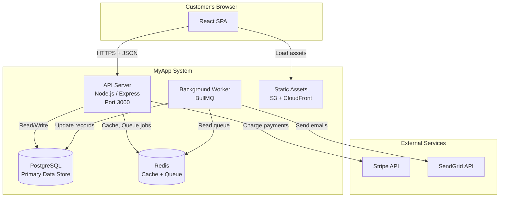
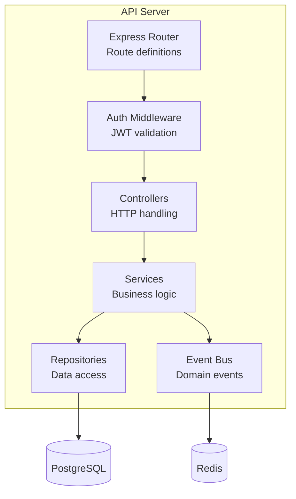
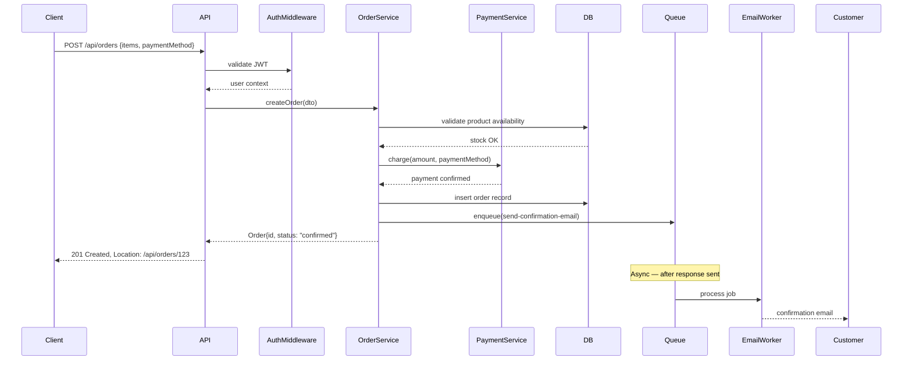
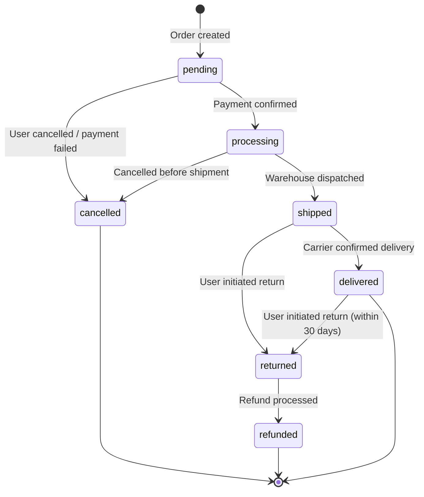
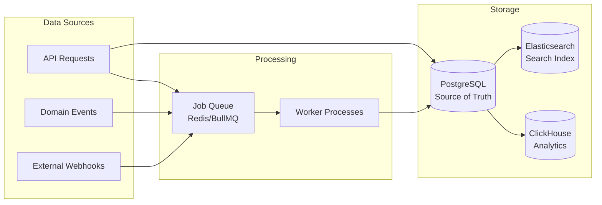

<!-- @keywords: architecture diagrams, C4 model, system design, component diagram, sequence diagram, Mermaid -->

# Architecture — Diagrams and Visual Documentation

## Core Philosophy

## When to Activate

> This skill should be activated when you need to resolve issues related to diagrams.

## Principles

### Level 1: System Context Diagram


---

### Level 2: Container Diagram


---

### Level 3: Component Diagram (API Server)


---

### Sequence Diagrams — Request Flows


---

### State Machine Diagrams


---

### Data Flow Diagrams


---

### Diagram Guidelines
```
When to create a diagram:
  ✓ Onboarding new team members
  ✓ Explaining a complex flow to stakeholders
  ✓ Designing a new feature before implementation
  ✓ Post-incident: documenting what happened

When NOT to create a diagram:
  ✗ To document something that code and tests already express clearly
  ✗ When it will be outdated before it's used

Keeping diagrams current:
  - Store diagrams as code (Mermaid, PlantUML) in the repo
  - Treat diagram updates as required part of feature PRs
  - Delete diagrams that are outdated and not worth maintaining

Level of detail:
  - System context: non-technical stakeholders can read it
  - Container: senior developers and architects
  - Component: developers working in that area
  - Sequence: developers debugging a specific flow
```

---

### Diagram Tools
```
Mermaid    → Text-based, renders in GitHub/GitLab, ideal for repos
PlantUML   → More diagram types, needs Java runtime
Excalidraw → Hand-drawn style, good for whiteboard sessions
Lucidchart → Professional, great for stakeholder presentations
draw.io    → Free, broad format support
C4 DSL     → Purpose-built for C4 model (Structurizr)
```

---

## Decision Framework

- Evaluate the complexity of the task.
- Identify structural bottlenecks.
- Choose the simplest abstraction that solves the problem.

## Anti-Patterns

- Over-engineering the solution.
- Ignoring context and copying blindly.
- Mixing concerns unnecessarily.

## Example in Action

The C4 model provides a hierarchy of diagrams, each addressing a different audience.

```
Level 1: System Context  → "What does the system do and who uses it?"
Level 2: Container       → "What are the deployable pieces?"
Level 3: Component       → "What are the major structural blocks?"
Level 4: Code            → "How is a component structured?" (rarely needed)
```

---

- [ ] System context diagram exists (how system fits in the world)
- [ ] Container diagram exists (deployable pieces and relationships)
- [ ] Sequence diagram for every critical user journey
- [ ] State machine diagram for any multi-state domain object
- [ ] Diagrams stored as code in the repository (not image files)
- [ ] Diagrams reviewed as part of architecture changes
- [ ] Outdated diagrams removed (stale docs are worse than no docs)
